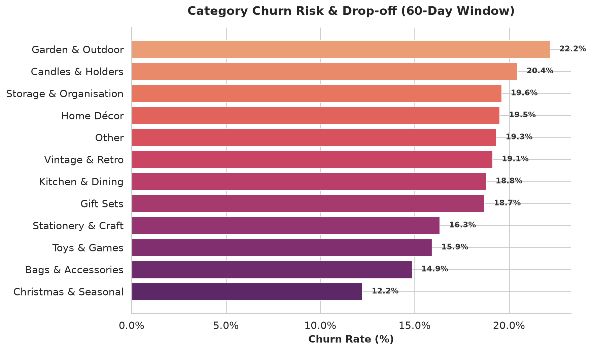
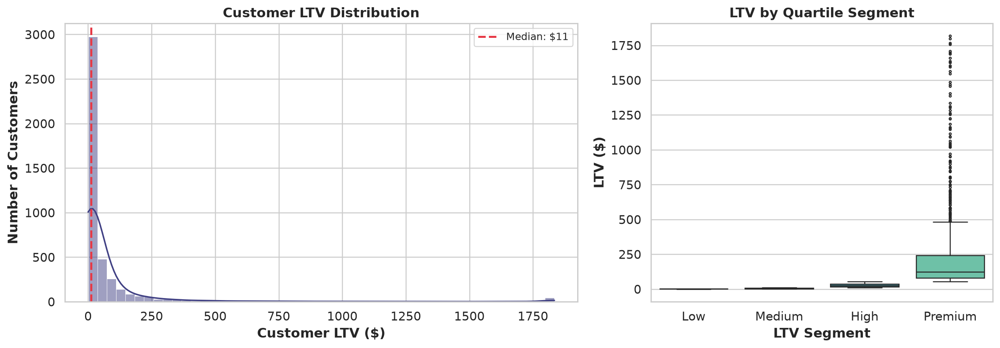
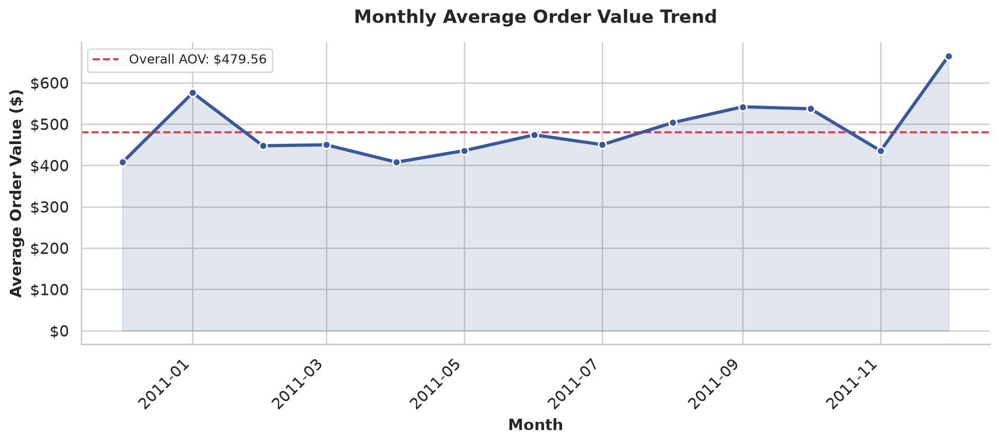

# E-Commerce Customer Retention & Churn Analysis

> A modular Python analytics pipeline that processes **541,909 real e-commerce transactions** from the UCI Online Retail dataset, cleans messy transactional data, and computes three mission-critical business metrics — **Churn Rate**, **Average Order Value (AOV)**, and **Customer Lifetime Value (LTV)**.

---

## Executive Summary & Key Business Findings

| Metric | Value | Insight |
|---|---|---|
| **60-Day Churn Rate** | **44.74%** | Nearly half of all customers are inactive — a major retention gap |
| **Average Order Value** | **$479.56** | High per-order spend suggests a B2B-heavy customer base |
| **Mean Customer LTV** | **$149.55** | Premium segment ($564 avg) drives 74% of total revenue |
| **Median Customer LTV** | **$11.40** | Huge skew — most customers are low-value one-time buyers |
| **Total Revenue** | **$8,887,209** | Across 18,532 unique orders from 4,338 customers |
| **Active Customers** | **2,397** (55%) | Retained within the last 60 days |
| **Churned Customers** | **1,941** (45%) | No purchase in 60+ days |

### Key Takeaways
- **High churn** — 1 in 2 customers doesn't return within 60 days. Targeted re-engagement campaigns (email, discounts) could recover significant revenue.
- **Premium segment dominance** — The top 25% of customers by LTV generate **$6.6M** of the **$8.9M** total. Losing even a few Premium customers has outsized impact.
- **AOV seasonality** — Monthly AOV spikes in September and December, suggesting holiday-driven purchasing patterns.

---

## Directory Architecture

```
Ecommerce-Analysis/
├── data/
│   ├── online_retail_500k.csv      # Full UCI dataset (541K rows, .gitignored)
│   ├── sample_transactions.csv     # 5,000-row sample (tracked in git)
│   └── .gitkeep
├── notebooks/
│   └── eda_and_visualizations.ipynb # Colab-ready notebook with inline charts
├── src/
│   ├── __init__.py                 # Package marker (v1.0.0)
│   ├── data_loader.py              # CSV loader with full/sample toggle
│   ├── cleaner.py                  # Handles nulls, cancellations, type casting
│   ├── metrics.py                  # Vectorized Churn, AOV, LTV calculations
│   └── visualization.py            # Three polished Seaborn chart routines
├── assets/
│   └── images/                     # Generated chart PNGs
│       ├── category_churn_risk.png
│       ├── ltv_distribution.png
│       └── monthly_aov_trend.png
├── tests/
│   └── test_metrics.py             # 14 pytest unit tests for all metrics
├── main.py                         # CLI entry point (--full-data flag)
├── requirements.txt                # pandas, numpy, matplotlib, seaborn, pytest
├── .gitignore                      # Excludes large CSVs, keeps sample
└── README.md                       # This file
```

---

## Core Business Metric Definitions

### 1. 60-Day Churn Rate

A customer is classified as **churned** if their most recent purchase is more than 60 days before the dataset's latest transaction date.

```
Churn Rate = (Churned Customers / Total Customers) × 100

where:
    Churned = last_purchase_date < (analysis_date - 60 days)
```

The 60-day window is an industry-standard threshold for e-commerce. It can be adjusted via the `window_days` parameter.

### 2. Average Order Value (AOV)

```
AOV = Total Revenue / Total Unique Orders (InvoiceNo)
```

Computed at the **invoice level** (not line-item level) for accuracy. Also broken down by product category and monthly trend.

### 3. Customer Lifetime Value (LTV)

```
LTV = AOV × Purchase Frequency × Customer Lifespan (years)

where:
    AOV              = Mean transaction value per customer
    Purchase Frequency = Number of unique orders per customer
    Customer Lifespan  = (Last Purchase - First Purchase) in years
                         (floored at 30 days for single-purchase customers)
```

Customers are segmented into **quartile tiers**: Low, Medium, High, Premium.

---

## Visualizations

### Category Churn Risk & Drop-off


### Customer LTV & Spend Distribution


### Monthly AOV Trend


---

## Quick Start

### Prerequisites

- Python 3.10+
- pip

### Local Setup

```bash
# 1. Clone the repository
git clone https://github.com/<YOUR_USERNAME>/Ecommerce-Analysis.git
cd Ecommerce-Analysis

# 2. Create virtual environment
python3 -m venv .venv
source .venv/bin/activate

# 3. Install dependencies
pip install -r requirements.txt

# 4. Run on sample data (5K rows, fast)
python main.py

# 5. Run on full dataset (541K rows)
python main.py --full-data
```

### Google Colab

1. Open the notebook: `notebooks/eda_and_visualizations.ipynb`
2. In the first cell, clone the repo:
```python
!git clone https://github.com/<YOUR_USERNAME>/Ecommerce-Analysis.git
%cd Ecommerce-Analysis
!pip install -r requirements.txt -q
```
3. Upload `online_retail_500k.csv` to `data/` (or use the included sample).
4. Run all cells — charts render inline.

### Running Tests

```bash
source .venv/bin/activate
python -m pytest tests/test_metrics.py -v
```

All 14 tests validate churn classification, AOV math, and LTV formula correctness against hand-computed expected values.

---

## Dataset

This project uses the [UCI Online Retail Dataset](https://archive.ics.uci.edu/ml/datasets/online+retail) — real transactional data from a UK-based online retailer (Dec 2010 – Dec 2011).

| Column | Type | Description |
|---|---|---|
| `InvoiceNo` | str | Invoice number (`C` prefix = cancellation) |
| `StockCode` | str | Product code |
| `Description` | str | Product name |
| `Quantity` | int | Units purchased |
| `InvoiceDate` | datetime | Transaction timestamp |
| `UnitPrice` | float | Price per unit (GBP) |
| `CustomerID` | float | Unique customer identifier (~23% missing) |
| `Country` | str | Customer country |

---

## Tech Stack

| Library | Version | Purpose |
|---|---|---|
| pandas | ≥ 2.0 | DataFrame operations & groupby aggregations |
| numpy | ≥ 1.24 | Vectorized numerical computations |
| matplotlib | ≥ 3.8 | Chart rendering backend |
| seaborn | ≥ 0.13 | Statistical visualization |
| pytest | ≥ 7.0 | Unit testing framework |

---

## License

This project is for educational and portfolio purposes. The UCI Online Retail Dataset is publicly available under its original terms.